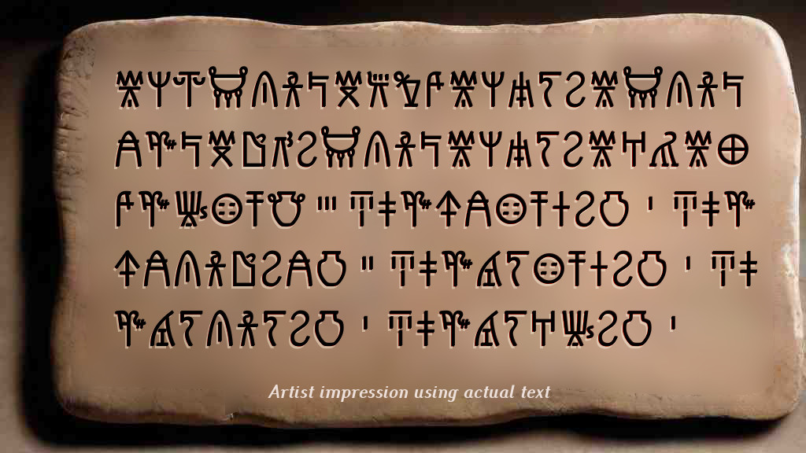

### Shape Theory: A Psychological and Historical Perspective
 
*A brief discussion on shape theory psychology* from childhood development and historical practices perspectives, by Andrew Kingdom.

#### **Introduction**:  
Shape theory examines how humans perceive, interpret, and utilize shapes across various contexts, ranging from early childhood development to historical practices. The core idea of shape theory is that certain shapes resonate more deeply with human psychology due to their frequent presence in natural environments and early visual experiences. This text aims to provide a grounded overview of shape theory, highlighting its basis in human development and historical context, avoiding the speculative nature of some other works on the subject. It explores how the familiarity and functionality of shapes like circles, squares, triangles, and hexagons influence human comfort and preference, tying these forms to both early developmental stages and broader cultural practices.

#### **Historical Background of Shape Theory**:
Shape theory has evolved over time through contributions from various fields, including psychology, anthropology, and art history. Early studies in shape perception focused on the geometric patterns found in nature and their symbolic meanings in ancient cultures. As a field, shape theory was formalized in the 20th century with the rise of Gestalt psychology, which emphasized the human tendency to perceive whole forms rather than individual components. The development of cognitive psychology further expanded the understanding of how shapes are processed by the brain, leading to applications in areas such as design, architecture, and software development. The goal of shape theory is to explore how shapes influence cognition, emotion, and behavior, providing a framework for understanding human interaction with visual forms.

#### **Circles**:  

Circles are one of the earliest shapes encountered by infants, primarily through the faces of caregivers and rounded objects in nature. A mother’s face, perceived up close, often appears as an oval or circle to a baby, fostering an early association with this shape. This familiarity explains why children’s initial drawings often feature circular scribbles. The development from scribbles to more structured circular representations reflects a child’s evolving motor skills and visual processing abilities. Historically, circles have been symbolic in various cultures, representing unity, continuity, and wholeness. The pervasive presence of circular forms, both in nature and human interaction, underpins the deep-seated comfort and affinity humans have for this shape.

#### **Squares**:  

 
*Children learn that square are good for building.*

Squares and rectangles are prevalent in human-made environments, from the walls of buildings to books and screens. Children’s interaction with square shapes often begins with simple block play, which teaches them about stability, balance, and spatial relationships. Stacking blocks into square towers helps children understand that right angles and flat surfaces contribute to a stable structure, mirroring architectural principles used throughout history. The preference for square shapes in construction and design also stems from their practicality and efficiency in creating functional spaces. Historically, the square has been a symbol of order and rationality, further cementing its importance in both individual cognitive development and cultural evolution.

#### **Triangles**:  

 
*Children learn that rain water falls best off a sharply angled roof.*

Triangles are significant in both natural and human-made structures due to their inherent stability and strength. In nature, sharp angles can be seen in the forms of mountain peaks, certain plants, and rock formations. Triangular shapes are also foundational in engineering and architecture, where they are used to distribute weight and provide structural integrity. For children, the recognition of triangles often comes through exposure to these natural forms or through simple geometric play. Triangles’ three-sided structure, fewer than squares or hexagons, makes them easier for children to conceptualize and draw. The triangle's importance extends to cultural and symbolic contexts, such as the use of pyramids in ancient Egypt, underscoring its versatility and enduring relevance.

#### **Hexagons**:  

 
*Children learn from observing nature, that a hexagon is a strong, compact shape.*

Hexagons are unique in their ability to combine the properties of both circles and angles, offering compactness and efficiency. In nature, hexagons are famously seen in honeycombs, which utilize this shape to maximize space while minimizing material use. This form appears less frequently in early childhood play compared to circles, squares, or triangles, but its structural efficiency is recognized in both nature and human design. Hexagons’ ability to tessellate without leaving gaps makes them valuable in various applications, from tiling floors to constructing carbon nanostructures. The hexagon’s frequent appearance in natural and engineered environments highlights its dual role as a shape that is both aesthetically pleasing and functionally superior.

## Recordkeeping

 
*** Needs lead-in and perspective here - we pick up on scribbling mentioned earlier and bring in all shapes for the purpose of discussing shapes as communications of expression, and as a historical memory. This could be subsumed into the Circles section but it's possibly better as a section in its own right?

Scribbling and Symbolic Development: Scribbling in early childhood reflects developmental milestones in motor skills and cognitive processes, including spatial awareness and symbolic representation. Research indicates that the progression from random scribbles to more recognizable shapes aligns with theories in developmental psychology that link motor activity with cognitive development. This stage is crucial for understanding how children conceptualize and externalize their perceptions of the world. 
&nbsp; 

## Historical and Cognitive Evolution in Writing Systems:

 
The evolution of writing systems provides insight into the human ability to abstract shapes and symbols for communication purposes. Early writing systems, such as cuneiform, oracle bone script and Egyptian hieroglyphs, illustrate the progression from pictographic to ideographic representations. These early forms often incorporated visual symbols that were abstracted from natural shapes or objects to represent concepts or sounds. The shift to alphabetic systems, including the Semitic and later Greek alphabets, represents a significant abstraction from logographic and syllabic scripts. This transition reflects a move towards more standardized and efficient forms of written communication, paralleling the increasing complexity of human thought and language. Understanding these historical shifts in symbolic representation enhances our comprehension of shape theory, illustrating the innate human capacity to abstract and communicate through visual forms. 
&nbsp; 

## Conclusion

Shape theory provides valuable insights into how humans interact with and perceive their environments, influenced by both psychological development and historical practices. By examining the early childhood experiences with shapes and their historical applications, we can appreciate the deep-seated human preferences for certain forms. This exploration challenges more speculative accounts by grounding shape theory in observable developmental milestones and cultural evolution, demonstrating that the familiarity and functionality of shapes like circles, squares, triangles, and hexagons are fundamental to human cognition and comfort.

My interest in this is largely because: psychology and childhood development theory forms an essential part of software design, which is a large part of what I do professionally.

May be freely reproduced so long as the author is credited. CC-BY
*A brief discussion on shape theory psychology by Andrew Kingdom*
